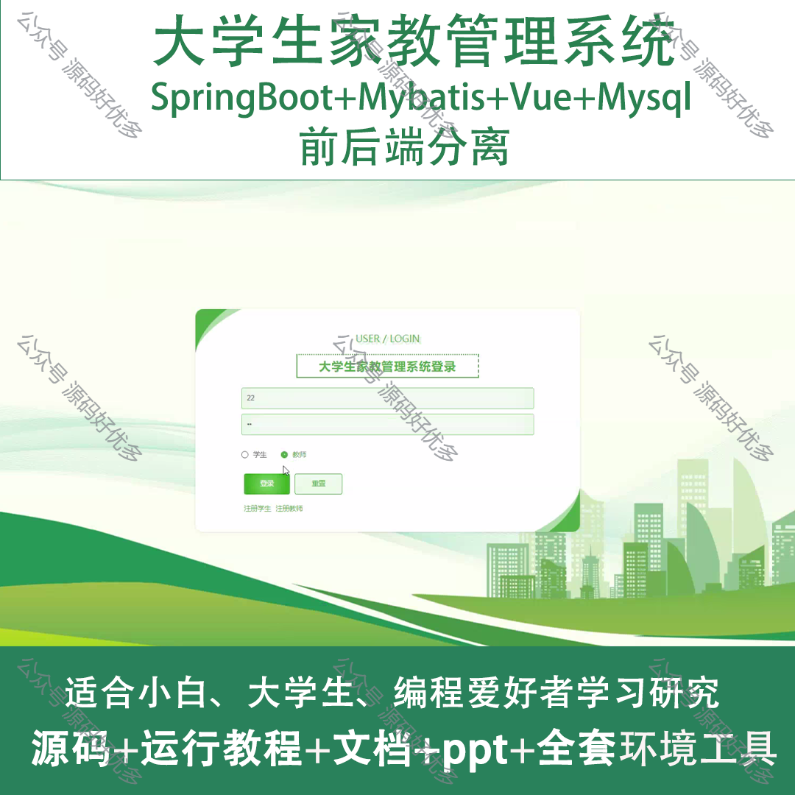
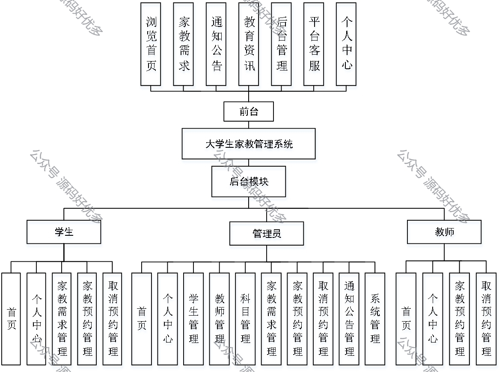
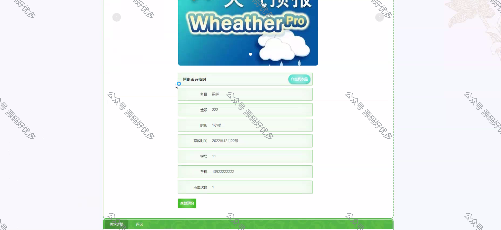
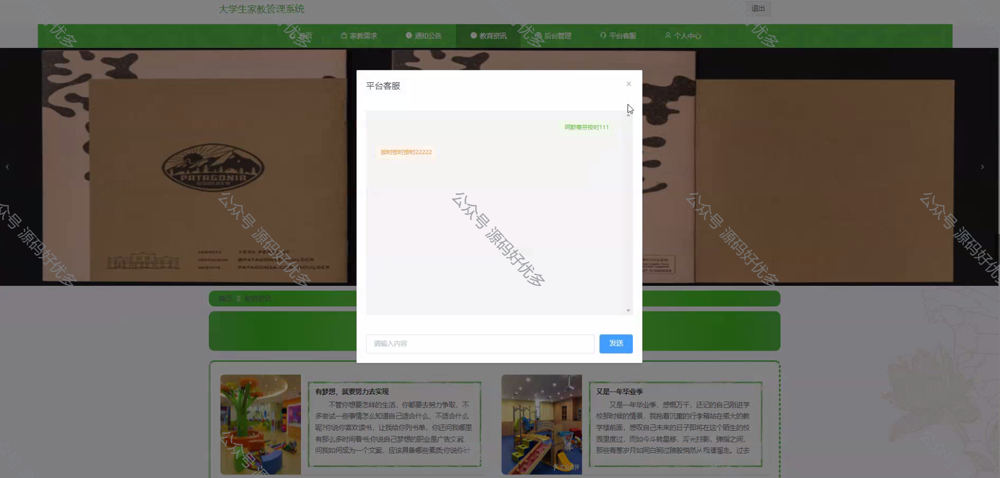
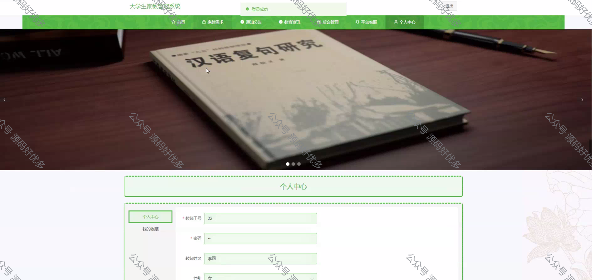
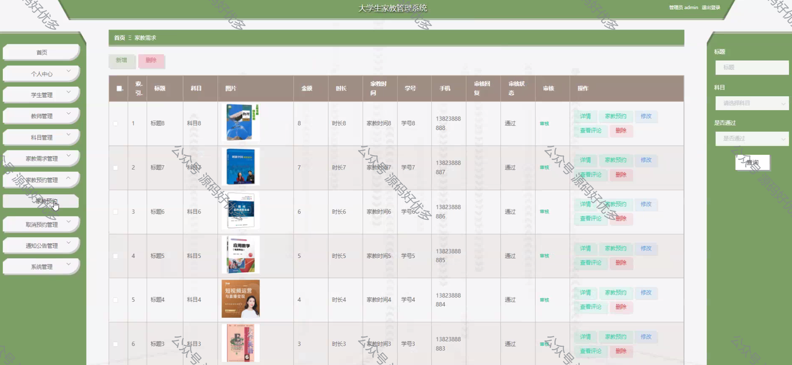
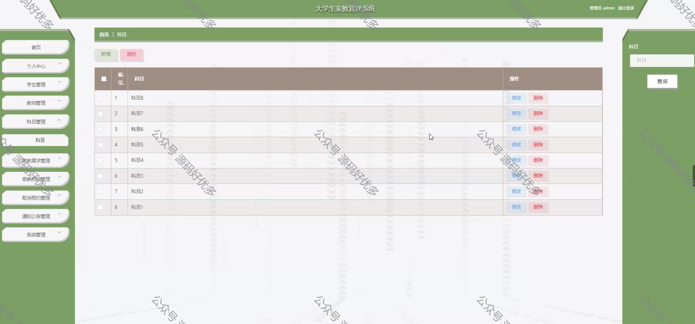
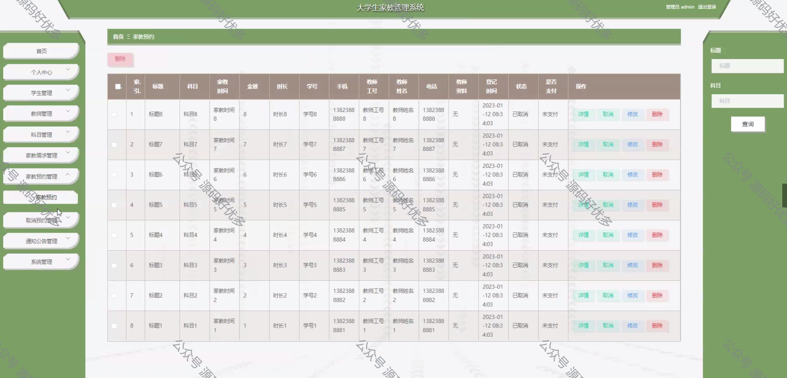
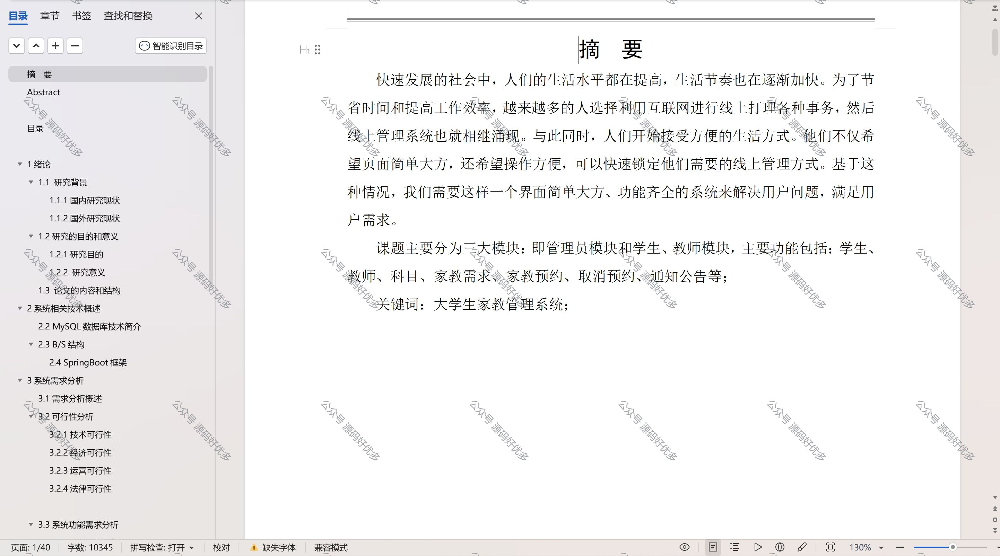

 
## 查看主页获取源码

> **作者介绍**： **✌**全网粉丝10W+本平台特邀作者、博客专家、CSDN新星计划导师、java领域优质创作者,博客之星、掘金/华为云/阿里云/InfoQ等平台优质作者、专注于项目实战 **✌**

  

### 一、作品包含

源码+数据库+设计文档万字+PPT+全套环境和工具资源+部署教程

### 二、项目技术

前端技术：Html、Css、Js、Vue、Element-ui

数据库：MySQL

后端技术：Java、Spring Boot、MyBatis

  

### 三、运行环境

开发工具：IDEA/eclipse

数据库：MySQL5.7

数据库管理工具：Navicat10以上版本

环境配置软件： JDK1.8+Maven3.6.3

前端Nodejs：14

### 四、项目介绍
项目编号：springbootA120

大学生家教管理系统是为了解决家教市场信息不对称、匹配效率低下的问题而设计的，它提供了一个平台，旨在提高家教服务的透明度和质量，促进家教行业的健康发展。

前台学生功能：浏览首页、家教需求、通知公告、教育资讯、后台管理、平台客服和个人中心。

后台分为管理员、学生、教师
管理员的功能：首页、个人中心、学生管理、教师管理、科目管理、家教需求管理、家教预约管理、取消预约管理、通知公告管理、系统管理。
学生的功能：首页、个人中心、家教需求管理、家教预约管理和取消预约管理。
教师的功能：首页、个人中心、家教预约管理、取消预约管理。

### 五、运行截图

  
